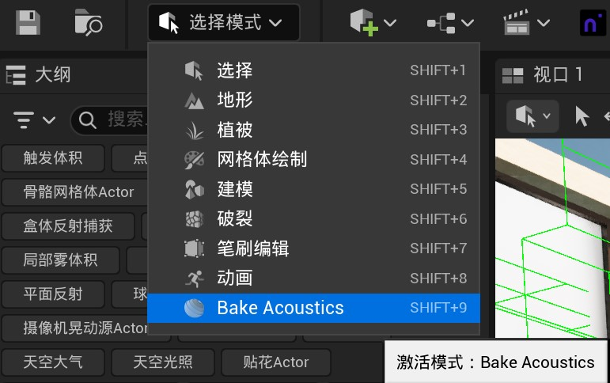

# ProjectAcousticsArchive / Project Acoustics 存档

一个 [Project Acoustics](https://github.com/microsoft/ProjectAcoustics) 及其处理器的**非官方存档**（Unofficial Archive）。

An **Unofficial Archive** for [Project Acoustics](https://github.com/microsoft/ProjectAcoustics) and its processors.

参见微软研究院 Triton 项目：https://www.microsoft.com/en-us/research/project/project-triton/

See Microsoft research project Triton: https://www.microsoft.com/en-us/research/project/project-triton/

我会尽量保持更新，但不做承诺。

I'll try to keep it updated, but no promises.

---

## 图文教程 / Step-by-Step Guide


### 第一步：切换至 Bake Acoustics 模式 / Step 1: Switch to Bake Acoustics Mode



在关卡编辑器工具栏中，点击 **Modes** 下拉菜单，选择 **Bake Acoustics** 模式。此时视口右侧会显示声学烘焙面板，包含 **Probes**、**Materials**、**Objects** 和 **Bake** 四个选项卡。

In the level editor toolbar, click the **Modes** dropdown and select **Bake Acoustics** mode. The acoustics bake panel will appear on the right side of the viewport with four tabs: **Probes**, **Materials**, **Objects**, and **Bake**.

---

## 教程与资源 / Tutorials & Resources

### 官方教程直播录像 / Official Tutorial Livestream

- [**Microsoft Project Acoustics UE5 Marketplace Plugin | Inside Unreal**](https://www.youtube.com/watch?v=3uocCX0AMIg) — 官方 UE5 插件教程直播，涵盖 Marketplace 插件安装、场景标记、材质分配、探针布局、Azure 烘焙、以及 Source Data Override 接口和 MetaSounds 集成。

  Official UE5 plugin walkthrough livestream, covering Marketplace plugin installation, scene markup, material assignment, probe layout, Azure baking, Source Data Override interface, and MetaSounds integration.

### 官方文档 / Official Documentation

- [Project Acoustics Unreal 插件概述 (Unreal Plugins Overview)](https://learn.microsoft.com/en-us/gaming/acoustics/unreal-overview)
- [Project Acoustics 文档中心 (Documentation Hub)](https://aka.ms/acoustics)
- [GitHub 官方仓库 (Official Repository)](https://github.com/microsoft/ProjectAcoustics)
- [UE Marketplace 插件页面 (Marketplace Plugin)](https://www.unrealengine.com/marketplace/en-US/product/project-acoustics-for-unreal-audio)

### 其他视频资源 / Additional Video Resources

- [**Microsoft Project Acoustics in Unreal Engine 5 | GameSoundCon 2022**](https://www.youtube.com/watch?v=MAMz9dSHU04) — UE5 集成走查，含 Lyra 示例 + MetaSounds
- [**Project Acoustics | GDC 2019**](https://www.youtube.com/watch?v=uY4G-GUAQIE) — 技术概览，波物理引擎原理与设计理念

### 示例项目 / Sample Project

- [Project Acoustics Sample for Unreal Engine](https://github.com/viayulo/AcousticsGameUE) — UE5 官方示例项目

## 测试验证 / Verified Environments

| 引擎版本 / Engine Version | 状态 / Status | 备注 / Notes |
|---|---|---|
| **Unreal Engine 5.7.4** | ✅ 编译通过 / Compiled | 发行版（Shipping），插件正常编译并启用运行 |
| **Unreal Engine 5.7.4** | ✅ Compiled Successfully | Shipping build; plugin compiles and enables without errors |

---

## TODO / 待办
- [ ] **创建一个 Demo 关卡** / **Create a Demo Level**
- [ ] **添加使用说明** / **Add Instructions for Usage**

---

## Issues / Bugfixes / 问题与修复

### 问题：Python 插件错误 / Issue: Python Plugin Error

如果你看到以下错误信息：

> **"python must be installed"**

（而 Python 插件实际已正确安装），且日志中出现如下错误：

If you see the error message:

> **"python must be installed"**

(while the Python plugin is correctly installed), and an error in the logs like this:

```
[2025.02.13-22.58.58:436][  0] LogPython: Display: Running start-up script C:/Projects/PA_Demo/Plugins/ProjectAcousticsNative/Content/Python/init_unreal.py... started...
[2025.02.13-22.58.58:587][  0] LogSourceControl: Uncontrolled asset enumeration finished in 0.190773 seconds (Found 7711 uncontrolled assets)
[2025.02.13-22.58.59:337][  0] LogPython: Error: System.NotSupportedException: An attempt was made to load an assembly from a network location which would have caused the assembly to be sandboxed in previous versions of the .NET Framework. This release of the .NET Framework does not enable CAS policy by default, so this load may be dangerous. If this load is not intended to sandbox the assembly, please enable the loadFromRemoteSources switch. See http://go.microsoft.com/fwlink/?LinkId=155569 for more information.
[2025.02.13-22.58.59:337][  0] LogPython: Error: The above exception was the direct cause of the following exception:
[2025.02.13-22.58.59:337][  0] LogPython: Error: Traceback (most recent call last):
```

---

### 修复方案 / Fix

1. 打开以下文件（Open the file）：
   ```
   C:\Windows\Microsoft.NET\Framework64\[你的 .NET 版本，如 4.0.x]\Config\machine.config
   ```

2. 找到这一行（Find this line）：
   ```xml
   <runtime/>
   ```

3. 将其替换为（Replace it with）：
   ```xml
   <runtime>
       <loadFromRemoteSources enabled="true"/>
   </runtime>
   ```

这应该可以解决 Unreal Engine 中沙箱程序集（sandboxed assembly）的错误。

This should resolve the issue with the sandboxed assembly error in Unreal Engine.
